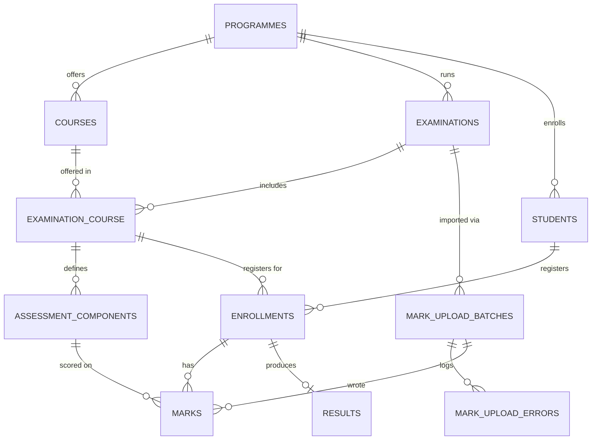

# University Examination & Result Processing System

A backend for running university examinations end to end: programmes and
courses, per-course assessment components, student enrollment, marks entry
(single-record and bulk CSV), and result calculation/publishing — built to
survive 100,000+ marks in one upload and scale toward 1,000,000 students.

## Quick start

```bash
git clone <this-repo>
cd exam-result-system
cp .env.example .env
docker compose up --build
```

This brings up: `app` (Laravel dev server on `:8000`), three `queue-worker`
replicas, a `scheduler`, `mysql`, and `redis`. The `app` container runs
`composer install`, generates `APP_KEY`, and runs migrations automatically —
no manual step needed. Seed sample data with:

```bash
docker compose exec app php artisan db:seed
```

API base URL: `http://localhost:8000/api`. Run tests with:

```bash
docker compose exec app php artisan test
```

## Architecture

A single Laravel monolith exposing a JSON API, backed by MySQL for durable
state and Redis for the queue. There's no separate "worker service" codebase —
`queue-worker` containers run the same image with `php artisan queue:work`,
so business logic (jobs, services) is shared between the HTTP path and the
async path instead of duplicated.

Layers:
- **Controllers** — thin: validate input, delegate, shape the response.
- **Services** (`app/Services`) — the actual business logic (CSV import
  orchestration, marks validation, result calculation), independent of
  HTTP so they're unit-testable and reusable from jobs or console commands.
- **Jobs** (`app/Jobs`) — anything that shouldn't block a request: chunked
  CSV processing, per-student result computation.
- **Models** — Eloquent, with relationships only; no business logic.

## Database design

### Core entities
- `programmes` → `courses` (1:N)
- `examinations` belongs to a `programme`; `examination_course` is the join
  table between an examination and the courses offered in it — a course can
  recur across many examinations (different semesters) with different
  `max_marks`/`pass_marks` each time, which is why this needs its own row
  and its own id rather than a plain pivot.
- `assessment_components` (e.g. Internal, Midterm, Final) hang off
  `examination_course`, each with a `max_marks` and a `weight_percentage`.
- `students` belong to a `programme`.
- `enrollments` is the join between a `student` and an `examination_course`
  — this is the row that `marks` and `results` key against, and the largest
  table in the system at scale (100,000+ students × multiple courses ×
  multiple examinations).
- `marks` — one row per (`enrollment`, `assessment_component`), written by
  either the CSV import or the single-record API.
- `results` — one computed row per `enrollment`.
- `mark_upload_batches` / `mark_upload_errors` — tracks one CSV upload's
  progress and any row-level failures.
- `idempotency_keys` — generic store used by the idempotency middleware.

### ER diagram



### Key indexing decisions (for scale)
- `marks(enrollment_id, assessment_component_id)` — unique. This is both the
  correctness constraint (one mark per component per student) and the
  performance index the CSV import's upsert relies on.
- `enrollments(student_id, examination_course_id)` — unique, plus a
  standalone index on `examination_course_id` for "all students in this
  course" queries (result computation fan-out).
- `students.roll_number`, `courses(programme_id, code)` — unique, since the
  CSV import resolves rows by these human-readable identifiers, not
  internal ids.
- No `SELECT *` on `marks`/`enrollments` in hot paths — every controller and
  job query filters on an indexed column.

## Queue design

Two queues, both backed by Redis, run on dedicated worker replicas:
- `marks-import` — one `ProcessMarksCsvChunk` job per ~2,000-row slice of an
  uploaded CSV (`MARKS_CSV_CHUNK_SIZE`). A 100,000-row file becomes 50 jobs
  that multiple workers can pull in parallel, instead of one long-running
  job that ties up a single worker and can't recover cleanly from a partial
  failure.
- `results` — one `CalculateStudentResult` job per enrollment, fanned out by
  `CalculateExaminationResults`. At 100,000+ students per examination this
  must be parallelized the same way; a single-threaded loop would take
  hours end to end and any mid-loop crash would lose progress.

Both fan-outs use `Bus::batch()` so the system knows when *all* chunks/jobs
for one upload or one examination have finished (`->finally()` flips the
batch's/examination's status), without a separate polling job.

## Transaction strategy

- **Idempotency-key check-and-insert** (`EnsureIdempotencyKey` middleware)
  runs the "has this key been seen" check and "insert progress marker" in
  one transaction with `lockForUpdate()`, so two concurrent requests with
  the same key can't both pass the check before either writes.
- **Single-mark writes** (`MarkController@store`) lock the target `marks`
  row (`lockForUpdate`) before checking `expected_version` and writing, so a
  read-modify-write from two staff members editing the same mark can't
  silently overwrite each other.
- **Result computation** (`CalculateStudentResult`) locks the `enrollments`
  row for the duration of the compute-and-upsert, so a mark correction that
  triggers a recompute can't interleave with an examination-wide recompute
  for the same student.
- CSV row imports are **not** individually wrapped in a transaction — each
  row's `updateOrCreate` is already atomic at the row level via the unique
  constraint, and wrapping 2,000 rows in one chunk transaction would hold a
  lock for the chunk's entire runtime for no correctness benefit.

## Idempotency strategy

Two mechanisms, for two different problems:

1. **Client-retry idempotency** (`X-Idempotency-Key` header, generic
   `EnsureIdempotencyKey` middleware, used on marks-upload and
   result-publish). Guards against a client retrying a request after a
   timeout: same key + same body → the original response is replayed, not
   re-executed; same key + different body → `409`; a key still mid-flight →
   `409` rather than a second execution.
2. **Data-level idempotency** (`marks` unique key on
   `(enrollment_id, assessment_component_id)`, used by
   `ProcessMarksCsvChunk`). Guards against re-processing: retrying a failed
   chunk, or re-running the whole import under a fresh key, upserts the same
   rows rather than duplicating them. This is what actually makes bulk
   import safe to retry at the row level, independent of the header.

## Concurrency strategy

- **Optimistic locking** on `marks.version` for manual single-record edits:
  a client sends back the version it last read; a stale write is rejected
  (`409`) instead of silently clobbering a concurrent edit.
- **Pessimistic locking** (`lockForUpdate`) where correctness can't tolerate
  even a rejected-and-retried race: idempotency-key check-and-set, and
  result computation per enrollment.
- **Atomic counters** (`DB::raw('column + n')`) for `mark_upload_batches`
  progress fields, since dozens of chunk-workers update the same batch row
  concurrently — a read-modify-write here would lose updates.
- **`ShouldBeUnique`** on `CalculateStudentResult`, keyed by enrollment id,
  so a mark-correction trigger and an examination-wide recompute can't both
  be queued for the same student at once; the queued duplicate is silently
  dropped rather than run.

## Failure / retry strategy

- CSV chunk jobs (`tries = 3`, backoff `10s/30s/60s`): a **row-level**
  failure (bad data, missing enrollment) is caught inside the job and
  logged to `mark_upload_errors` — it does not fail the job or block the
  rest of the chunk. A **job-level** failure (e.g. DB connection drop)
  retries with backoff, then lands in `failed_jobs` for inspection; the
  batch's `completed_chunks` still increments in `failed()` so the batch's
  progress counters stay accurate even for a chunk that never succeeds.
- Result jobs (`tries = 5`, backoff up to 120s) — more retries, since a
  transient lock-wait timeout under heavy concurrent recompute is expected
  and should self-resolve rather than surface to a user.
- `Bus::batch()->allowFailures()` on both fan-outs so one bad chunk/student
  doesn't cancel the rest of the batch.
- Every batch exposes `GET /mark-uploads/{id}` (progress) and
  `GET /mark-uploads/{id}/errors` (paginated row errors) so a caller can
  see exactly which rows failed and re-submit a corrected CSV for just
  those, without re-processing the rows that already succeeded (they're
  no-ops on retry thanks to the unique-key upsert).

## Scaling considerations

- **Horizontal workers**: `docker-compose.yml` runs 3 `queue-worker`
  replicas by default across two queues; this scales linearly by adding
  replicas since chunk/job assignment happens naturally via Redis's blocking
  pop — no coordination code needed.
- **Chunked, not streamed, CSV processing**: reading the whole file inline
  on the request thread would time out well before 100,000 rows; instead
  the request only counts rows and dispatches jobs, keeping the HTTP
  response fast regardless of file size.
- **Indexes over full scans**: every hot-path query (enrollment lookup by
  roll number + course code, result fan-out by examination) hits a
  composite index; see "Key indexing decisions" above.
- **Read/write split readiness**: result and mark reads (`GET` endpoints)
  don't touch tables mid-write, so a read replica could be added behind
  Eloquent's `sticky`/read-write connection config with no application code
  change, if student-facing result lookups (1,000,000 students) needed to
  be offloaded from the primary.
- **Partitioning path**: `marks` and `enrollments` are natural candidates
  for partitioning by `examination_id` (via a denormalized column) once a
  single MySQL instance can't hold the working set — not implemented here,
  since the assignment's scale target doesn't yet require it, but the
  schema doesn't preclude adding it.
- **Queue isolation**: `marks-import` and `results` are separate queues on
  separate worker pools so a burst of CSV uploads can't starve result
  computation (or vice versa).

## Technology choices

- **Laravel 11** — the team's primary stack (Naman's background is
  Laravel/PHP), with first-class support for queues, batching, and
  Eloquent's locking primitives used throughout.
- **MySQL** — strong support for composite unique constraints and row
  locking (`SELECT ... FOR UPDATE`), which this design leans on heavily for
  idempotency and concurrency; InnoDB's row-level locking scales better
  under concurrent writers than table-level alternatives.
- **Redis** — queue backend and cache; chosen over the database queue
  driver so 100,000+ queued chunk jobs don't themselves become write
  pressure on MySQL.
- **league/csv** — streaming CSV reader; avoids loading the whole file into
  memory to count rows or read a chunk.
- **Sanctum** — lightweight token auth, sufficient for an internal
  admin/staff-facing API; no need for full OAuth given the assignment scope.

## Trade-offs / assumptions (explicitly incomplete areas)

- **No UI** beyond the JSON API, as invited by the brief; a Postman/Swagger
  collection is the intended client. `l5-swagger` is wired into
  `composer.json` but annotations aren't written for every endpoint —
  would add this next given more time.
- **Auth is minimal**: Sanctum token auth with a `role` column on `users`,
  but no policy/gate layer enforcing who can upload marks vs. publish
  results — assumed out of scope for a backend-architecture assessment, but
  called out here as an intentional gap.
- **Grade boundaries are hardcoded** in `ResultCalculationService`; a real
  system would likely make grading scales configurable per programme.
- **No malicious-CSV hardening beyond size limits** (e.g. no antivirus
  scan, no column-injection sanitization beyond type casting) — noted as a
  production gap, not implemented here.
- **Partitioning, read replicas, and full-text search on student names**
  are designed for (see Scaling) but not implemented, since the current
  scale target is comfortably served by indexed MySQL + horizontal queue
  workers, and adding them without a real load test would be premature.
- **Single-region deployment** assumed; no multi-region/DR strategy.

## API overview

### Authentication (public — no token required)

| Method | Path | Purpose |
|---|---|---|
| POST | `/auth/register` | Create a user and receive a Sanctum token |
| POST | `/auth/login` | Login with email/password, receive a Sanctum token |

### Protected endpoints (Sanctum bearer token required)

| Method | Path | Purpose |
|---|---|---|
| GET/POST | `/programmes` | List / create programmes |
| GET | `/programmes/{id}` | Show a programme with its courses |
| GET/POST | `/programmes/{id}/courses` | List / create courses in a programme |
| GET/POST | `/examinations` | List / create examinations |
| GET | `/examinations/{id}` | Show an examination with courses & components |
| PATCH | `/examinations/{id}/status` | Move an examination through its lifecycle |
| POST | `/examinations/{id}/courses` | Attach a course to an examination |
| GET/POST | `/examination-courses/{id}/components` | List / add assessment components |
| GET/POST | `/students` | List / create students |
| GET | `/students/{id}` | Show a student with enrolments |
| POST | `/enrollments` | Enroll a student in an examination course |
| POST | `/marks` | Single-record mark entry/correction (optimistic lock) |
| POST | `/examinations/{id}/marks/upload` | Bulk CSV upload (requires `X-Idempotency-Key`) — 202, returns a batch id |
| GET | `/mark-uploads/{id}` | Poll upload progress |
| GET | `/mark-uploads/{id}/errors` | Paginated row-level import errors |
| POST | `/examinations/{id}/results/compute` | Fan out result computation (async) |
| POST | `/examinations/{id}/results/publish` | Publish computed results (requires `X-Idempotency-Key`) |
| GET | `/enrollments/{id}/result` | Fetch a published result |

### CSV format for bulk upload

```csv
roll_number,course_code,component_name,marks_obtained
CSE2026001,CS301,Internal,27
CSE2026001,CS301,Final,61
```

## Postman collection (quick demo)

A ready-to-use Postman collection is included at
[`postman_collection.json`](postman_collection.json). Import it into
Postman (or Bruno / Insomnia) and walk through the folders in order:

1. **Auth** → Login with seeded credentials (`admin@exam.edu` / `password`).
   The token is auto-saved to all subsequent requests.
2. **Setup** → Create programmes, courses, examinations, assessment components
   (or skip — the seeder has already created these).
3. **Students & Enrollment** → Create students and enroll them.
4. **Marks Entry** → Single-record entry, optimistic-lock correction, and
   bulk CSV upload with `sample_marks.csv`.
5. **Results** → Compute → Lock → Publish → View individual results.
6. **Idempotency Demo** → Replay the same upload and verify the server
   returns the cached response.

A sample CSV (`sample_marks.csv`) is included in the project root for the
bulk-upload requests.

## Load-testing the bulk import

Generate a large CSV locally, e.g.:

```bash
php -r '
$f = fopen("large.csv", "w");
fputcsv($f, ["roll_number","course_code","component_name","marks_obtained"]);
for ($i = 1; $i <= 100000; $i++) {
    fputcsv($f, [sprintf("CSE2026%05d", $i % 20000 + 1), "CS301", "Final", rand(30, 70)]);
}
'
```

then `POST` it to `/examinations/{id}/marks/upload` with a unique
`X-Idempotency-Key`, and poll `/mark-uploads/{id}` for progress.
